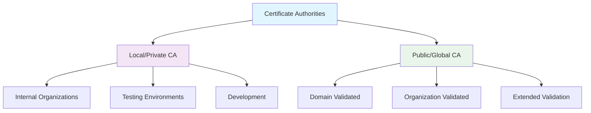
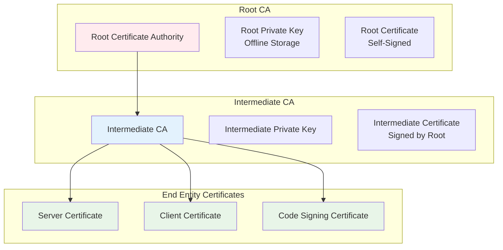
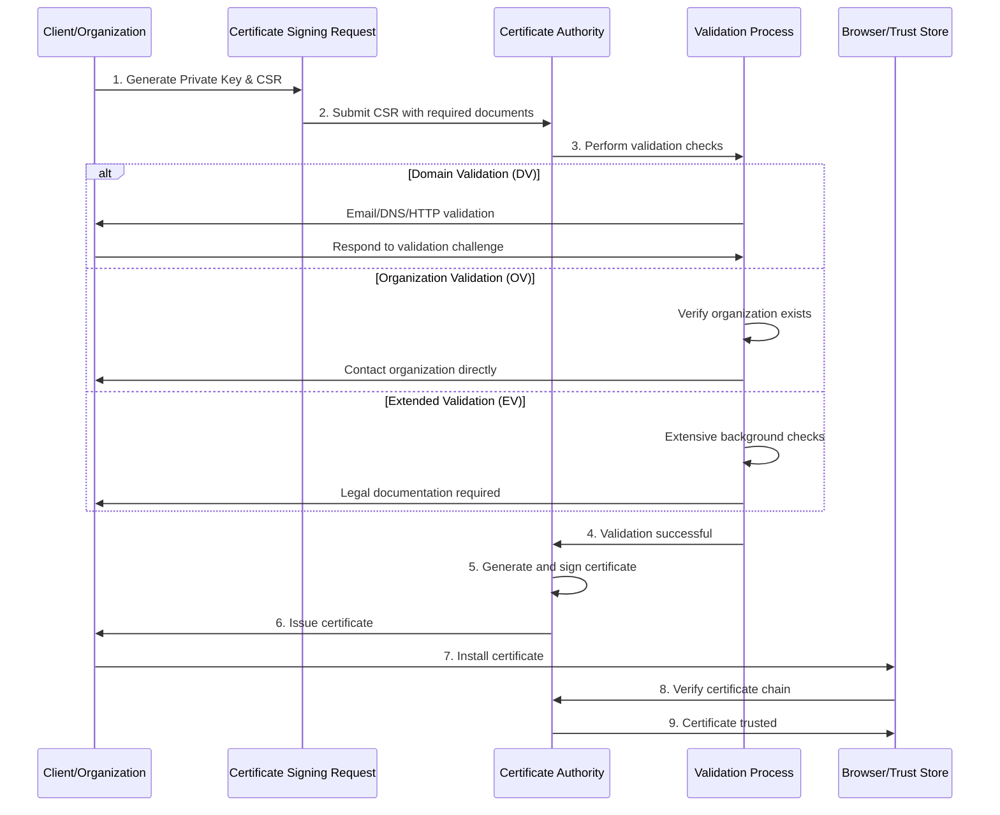
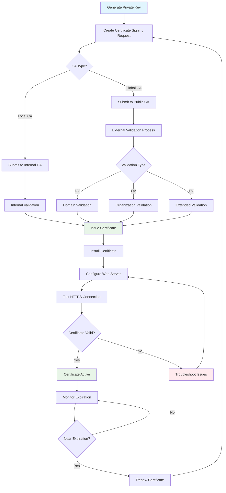
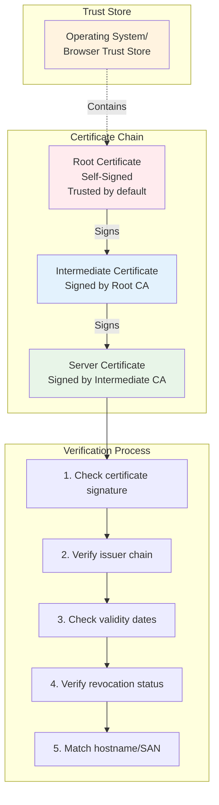
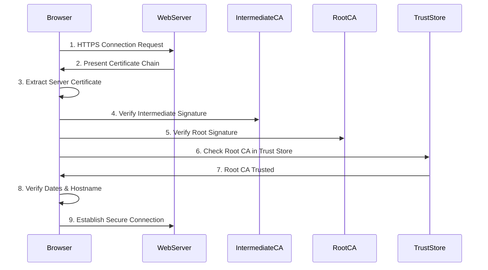
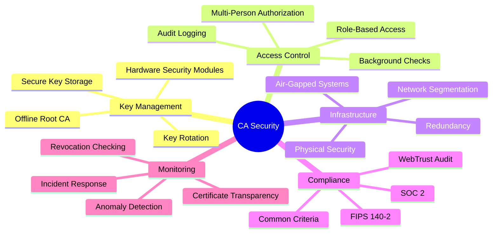

# Certificate Authority (CA) - Complete Guide

## Table of Contents
1. [Introduction to Certificate Authorities](#introduction)
2. [Types of Certificate Authorities](#types-of-cas)
3. [Certificate Authority Architecture](#ca-architecture)
4. [Local CA Authority Setup](#local-ca-setup)
5. [Global CA Authority Flow](#global-ca-flow)
6. [Certificate Request and Issuance Process](#certificate-process)
7. [Practical Examples with Commands](#practical-examples)
8. [Trust Chain and Verification](#trust-chain)
9. [Best Practices and Security](#best-practices)

## Introduction to Certificate Authorities {#introduction}

A Certificate Authority (CA) is a trusted entity that issues digital certificates to verify the identity of entities (websites, organizations, individuals) in a public key infrastructure (PKI). CAs play a crucial role in establishing trust in digital communications.

### What is a Digital Certificate?
A digital certificate is an electronic document that uses a digital signature to bind a public key with an identity. It contains:
- Subject's public key
- Subject's identity information
- Digital signature of the CA
- Validity period
- Certificate serial number

## Types of Certificate Authorities {#types-of-cas}



### Local/Private CA
- Used within organizations
- Self-managed
- Lower cost
- Full control over certificate lifecycle
- Not trusted by default in browsers

### Global/Public CA
- Trusted by browsers and operating systems
- Commercially operated
- Higher cost
- Strict validation requirements
- Automatically trusted

## Certificate Authority Architecture {#ca-architecture}



## Local CA Authority Setup {#local-ca-setup}

### Step 1: Create Directory Structure

```bash
# Create CA directory structure
mkdir -p /opt/ca/{root-ca,intermediate-ca}/{private,certs,newcerts,crl}
cd /opt/ca

# Set proper permissions
chmod 700 root-ca/private intermediate-ca/private
```

### Step 2: Create Root CA Configuration

```bash
# Create root CA configuration file
cat > root-ca/openssl.cnf << 'EOF'
[ ca ]
default_ca = CA_default

[ CA_default ]
dir               = /opt/ca/root-ca
certs             = $dir/certs
crl_dir           = $dir/crl
new_certs_dir     = $dir/newcerts
database          = $dir/index.txt
serial            = $dir/serial
RANDFILE          = $dir/private/.rand

private_key       = $dir/private/ca.key.pem
certificate       = $dir/certs/ca.cert.pem

crlnumber         = $dir/crlnumber
crl               = $dir/crl/ca.crl.pem
crl_extensions    = crl_ext
default_crl_days  = 30

default_md        = sha256
name_opt          = ca_default
cert_opt          = ca_default
default_days      = 3650
preserve          = no
policy            = policy_strict

[ policy_strict ]
countryName             = match
stateOrProvinceName     = match
organizationName        = match
organizationalUnitName  = optional
commonName              = supplied
emailAddress            = optional

[ policy_loose ]
countryName             = optional
stateOrProvinceName     = optional
localityName            = optional
organizationName        = optional
organizationalUnitName  = optional
commonName              = supplied
emailAddress            = optional

[ req ]
default_bits        = 2048
distinguished_name  = req_distinguished_name
string_mask         = utf8only
default_md          = sha256
x509_extensions     = v3_ca

[ req_distinguished_name ]
countryName                     = Country Name (2 letter code)
stateOrProvinceName             = State or Province Name
localityName                    = Locality Name
0.organizationName              = Organization Name
organizationalUnitName          = Organizational Unit Name
commonName                      = Common Name
emailAddress                    = Email Address

[ v3_ca ]
subjectKeyIdentifier = hash
authorityKeyIdentifier = keyid:always,issuer
basicConstraints = critical, CA:true
keyUsage = critical, digitalSignature, cRLSign, keyCertSign

[ v3_intermediate_ca ]
subjectKeyIdentifier = hash
authorityKeyIdentifier = keyid:always,issuer
basicConstraints = critical, CA:true, pathlen:0
keyUsage = critical, digitalSignature, cRLSign, keyCertSign

[ usr_cert ]
basicConstraints = CA:FALSE
nsCertType = client, email
nsComment = "OpenSSL Generated Client Certificate"
subjectKeyIdentifier = hash
authorityKeyIdentifier = keyid,issuer
keyUsage = critical, nonRepudiation, digitalSignature, keyEncipherment
extendedKeyUsage = clientAuth, emailProtection

[ server_cert ]
basicConstraints = CA:FALSE
nsCertType = server
nsComment = "OpenSSL Generated Server Certificate"
subjectKeyIdentifier = hash
authorityKeyIdentifier = keyid,issuer:always
keyUsage = critical, digitalSignature, keyEncipherment
extendedKeyUsage = serverAuth

[ crl_ext ]
authorityKeyIdentifier=keyid:always

[ ocsp ]
basicConstraints = CA:FALSE
subjectKeyIdentifier = hash
authorityKeyIdentifier = keyid,issuer
keyUsage = critical, digitalSignature
extendedKeyUsage = critical, OCSPSigning
EOF
```

### Step 3: Initialize CA Database

```bash
# Initialize root CA database
cd /opt/ca/root-ca
touch index.txt
echo 1000 > serial
echo 1000 > crlnumber
```

### Step 4: Create Root CA Private Key

```bash
# Generate root CA private key (keep this secure!)
openssl genrsa -aes256 -out private/ca.key.pem 4096
chmod 400 private/ca.key.pem
```

### Step 5: Create Root CA Certificate

```bash
# Create root CA certificate (self-signed)
openssl req -config openssl.cnf \
    -key private/ca.key.pem \
    -new -x509 -days 7300 -sha256 -extensions v3_ca \
    -out certs/ca.cert.pem \
    -subj "/C=US/ST=CA/L=San Francisco/O=My Company/OU=IT/CN=My Company Root CA"

chmod 444 certs/ca.cert.pem
```

### Step 6: Create Intermediate CA

```bash
# Create intermediate CA configuration
cat > /opt/ca/intermediate-ca/openssl.cnf << 'EOF'
[ ca ]
default_ca = CA_default

[ CA_default ]
dir               = /opt/ca/intermediate-ca
certs             = $dir/certs
crl_dir           = $dir/crl
new_certs_dir     = $dir/newcerts
database          = $dir/index.txt
serial            = $dir/serial
RANDFILE          = $dir/private/.rand

private_key       = $dir/private/intermediate.key.pem
certificate       = $dir/certs/intermediate.cert.pem

crlnumber         = $dir/crlnumber
crl               = $dir/crl/intermediate.crl.pem
crl_extensions    = crl_ext
default_crl_days  = 30

default_md        = sha256
name_opt          = ca_default
cert_opt          = ca_default
default_days      = 375
preserve          = no
policy            = policy_loose

[ policy_strict ]
countryName             = match
stateOrProvinceName     = match
organizationName        = match
organizationalUnitName  = optional
commonName              = supplied
emailAddress            = optional

[ policy_loose ]
countryName             = optional
stateOrProvinceName     = optional
localityName            = optional
organizationName        = optional
organizationalUnitName  = optional
commonName              = supplied
emailAddress            = optional

[ req ]
default_bits        = 2048
distinguished_name  = req_distinguished_name
string_mask         = utf8only
default_md          = sha256

[ req_distinguished_name ]
countryName                     = Country Name (2 letter code)
stateOrProvinceName             = State or Province Name
localityName                    = Locality Name
0.organizationName              = Organization Name
organizationalUnitName          = Organizational Unit Name
commonName                      = Common Name
emailAddress                    = Email Address

[ v3_intermediate_ca ]
subjectKeyIdentifier = hash
authorityKeyIdentifier = keyid:always,issuer
basicConstraints = critical, CA:true, pathlen:0
keyUsage = critical, digitalSignature, cRLSign, keyCertSign

[ usr_cert ]
basicConstraints = CA:FALSE
nsCertType = client, email
nsComment = "OpenSSL Generated Client Certificate"
subjectKeyIdentifier = hash
authorityKeyIdentifier = keyid,issuer
keyUsage = critical, nonRepudiation, digitalSignature, keyEncipherment
extendedKeyUsage = clientAuth, emailProtection

[ server_cert ]
basicConstraints = CA:FALSE
nsCertType = server
nsComment = "OpenSSL Generated Server Certificate"
subjectKeyIdentifier = hash
authorityKeyIdentifier = keyid,issuer:always
keyUsage = critical, digitalSignature, keyEncipherment
extendedKeyUsage = serverAuth
subjectAltName = @alt_names

[ alt_names ]
DNS.1 = localhost
DNS.2 = *.example.com
IP.1 = 127.0.0.1

[ crl_ext ]
authorityKeyIdentifier=keyid:always

[ ocsp ]
basicConstraints = CA:FALSE
subjectKeyIdentifier = hash
authorityKeyIdentifier = keyid,issuer
keyUsage = critical, digitalSignature
extendedKeyUsage = critical, OCSPSigning
EOF

# Initialize intermediate CA database
cd /opt/ca/intermediate-ca
touch index.txt
echo 1000 > serial
echo 1000 > crlnumber

# Generate intermediate CA private key
openssl genrsa -aes256 -out private/intermediate.key.pem 4096
chmod 400 private/intermediate.key.pem

# Create intermediate CA certificate signing request
openssl req -config openssl.cnf -new -sha256 \
    -key private/intermediate.key.pem \
    -out csr/intermediate.csr.pem \
    -subj "/C=US/ST=CA/L=San Francisco/O=My Company/OU=IT/CN=My Company Intermediate CA"

# Sign intermediate CA certificate with root CA
cd /opt/ca/root-ca
openssl ca -config openssl.cnf -extensions v3_intermediate_ca \
    -days 3650 -notext -md sha256 \
    -in ../intermediate-ca/csr/intermediate.csr.pem \
    -out ../intermediate-ca/certs/intermediate.cert.pem

chmod 444 ../intermediate-ca/certs/intermediate.cert.pem
```

### Step 7: Create Certificate Chain

```bash
# Create certificate chain file
cat /opt/ca/intermediate-ca/certs/intermediate.cert.pem \
    /opt/ca/root-ca/certs/ca.cert.pem > \
    /opt/ca/intermediate-ca/certs/ca-chain.cert.pem

chmod 444 /opt/ca/intermediate-ca/certs/ca-chain.cert.pem
```

## Global CA Authority Flow {#global-ca-flow}



### Popular Global CAs
- **Let's Encrypt** (Free, automated)
- **DigiCert**
- **Comodo/Sectigo**
- **GoDaddy**
- **GlobalSign**
- **Entrust**

## Certificate Request and Issuance Process {#certificate-process}

### Complete Certificate Lifecycle Diagram



## Practical Examples with Commands {#practical-examples}

### Example 1: Creating a Server Certificate with Local CA

```bash
# Step 1: Generate server private key
openssl genrsa -out server.key.pem 2048

# Step 2: Create certificate signing request
openssl req -config /opt/ca/intermediate-ca/openssl.cnf \
    -key server.key.pem \
    -new -sha256 -out server.csr.pem \
    -subj "/C=US/ST=CA/L=San Francisco/O=My Company/OU=IT/CN=www.example.com"

# Step 3: Sign the certificate with intermediate CA
cd /opt/ca/intermediate-ca
openssl ca -config openssl.cnf \
    -extensions server_cert -days 375 -notext -md sha256 \
    -in server.csr.pem \
    -out certs/server.cert.pem

# Step 4: Verify the certificate
openssl x509 -noout -text -in certs/server.cert.pem

# Step 5: Verify certificate chain
openssl verify -CAfile certs/ca-chain.cert.pem certs/server.cert.pem
```

### Example 2: Creating a Client Certificate

```bash
# Generate client private key
openssl genrsa -out client.key.pem 2048

# Create client certificate signing request
openssl req -config /opt/ca/intermediate-ca/openssl.cnf \
    -key client.key.pem \
    -new -sha256 -out client.csr.pem \
    -subj "/C=US/ST=CA/L=San Francisco/O=My Company/OU=IT/CN=john.doe@example.com"

# Sign the client certificate
cd /opt/ca/intermediate-ca
openssl ca -config openssl.cnf \
    -extensions usr_cert -days 375 -notext -md sha256 \
    -in client.csr.pem \
    -out certs/client.cert.pem

# Create PKCS#12 bundle for client
openssl pkcs12 -export -out client.p12 \
    -inkey client.key.pem \
    -in certs/client.cert.pem \
    -certfile certs/ca-chain.cert.pem
```

### Example 3: Using Let's Encrypt (Certbot)

```bash
# Install certbot
sudo apt-get update
sudo apt-get install certbot python3-certbot-nginx

# Obtain certificate for domain
sudo certbot --nginx -d example.com -d www.example.com

# Test automatic renewal
sudo certbot renew --dry-run

# Certificate files location
ls -la /etc/letsencrypt/live/example.com/
# cert.pem - certificate
# chain.pem - intermediate certificate
# fullchain.pem - certificate + chain
# privkey.pem - private key
```

### Example 4: Certificate Information Commands

```bash
# View certificate details
openssl x509 -in certificate.pem -text -noout

# Check certificate expiration
openssl x509 -in certificate.pem -noout -dates

# Verify certificate against CA
openssl verify -CAfile ca-chain.cert.pem certificate.pem

# Check certificate and key match
openssl x509 -noout -modulus -in certificate.pem | openssl md5
openssl rsa -noout -modulus -in private-key.pem | openssl md5

# Test SSL connection
openssl s_client -connect example.com:443 -servername example.com

# Extract certificate from website
echo | openssl s_client -connect example.com:443 2>/dev/null | openssl x509 -text
```

## Trust Chain and Verification {#trust-chain}

### Certificate Trust Chain



### Trust Establishment Process



## Certificate Validation Process

### Domain Validation (DV)

```bash
# HTTP-01 Challenge Example
# CA places a file at: http://example.com/.well-known/acme-challenge/token
# File contains: token.account_key_thumbprint

# DNS-01 Challenge Example
# Add TXT record: _acme-challenge.example.com
# Value: base64-encoded SHA256 digest
```

### Organization Validation (OV)
1. Domain control validation
2. Organization existence verification
3. Authorized representative confirmation
4. Phone verification

### Extended Validation (EV)
1. All OV requirements
2. Legal existence verification
3. Physical location verification
4. Authorized representative verification
5. Exclusive control verification

## Best Practices and Security {#best-practices}

### CA Security Best Practices



### Certificate Management Best Practices

1. **Key Length and Algorithms**
   ```bash
   # Use strong key lengths
   openssl genrsa -out private.key 2048  # Minimum
   openssl genrsa -out private.key 4096  # Recommended
   
   # Use secure algorithms
   -sha256  # Minimum hash algorithm
   ```

2. **Certificate Lifecycle Management**
   ```bash
   # Monitor certificate expiration
   openssl x509 -in cert.pem -noout -dates
   
   # Set up automated renewal
   0 0,12 * * * /path/to/certbot-auto renew --quiet
   ```

3. **Proper Certificate Storage**
   ```bash
   # Secure private key permissions
   chmod 600 private.key
   chown root:root private.key
   
   # Public certificate permissions
   chmod 644 certificate.pem
   ```

4. **Certificate Revocation**
   ```bash
   # Revoke a certificate
   openssl ca -config openssl.cnf -revoke cert.pem
   
   # Generate CRL
   openssl ca -config openssl.cnf -gencrl -out crl.pem
   ```

### Security Checklist

- [ ] Use strong private keys (2048-bit minimum)
- [ ] Implement proper key storage and access controls
- [ ] Regular certificate inventory and monitoring
- [ ] Automated certificate renewal
- [ ] Certificate transparency monitoring
- [ ] Implement OCSP/CRL for revocation checking
- [ ] Regular security audits
- [ ] Incident response procedures
- [ ] Staff training and awareness

### Common Vulnerabilities and Mitigations

| Vulnerability | Description | Mitigation |
|---------------|-------------|------------|
| Weak Keys | Using small key sizes or weak algorithms | Use 2048-bit+ RSA or 256-bit+ ECC |
| Key Compromise | Private key exposure | Implement HSMs, key rotation |
| Certificate Pinning Bypass | Attackers bypass certificate validation | Implement certificate/key pinning |
| Subdomain Certificate Abuse | Wildcard certificate misuse | Use specific domain certificates |
| Certificate Authority Compromise | CA private key compromise | Certificate Transparency, monitoring |

This comprehensive guide covers the complete flow of certificate authorities, from local CA setup to global CA processes, with practical examples and security best practices.